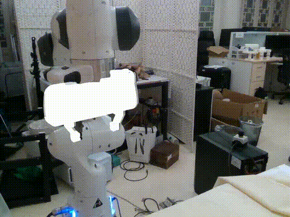
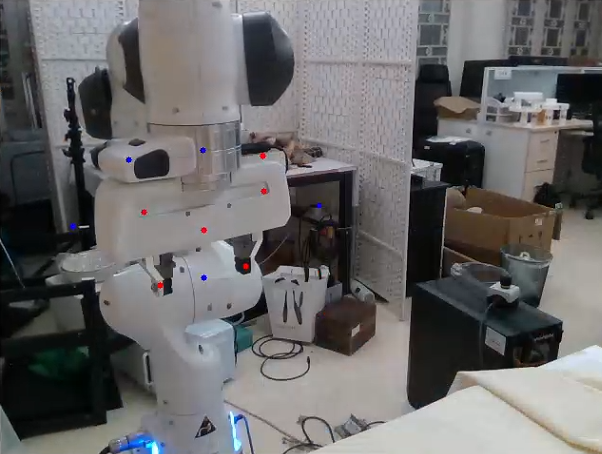

# Foundation Feature-Driven Online End-Effector Pose Estimation: A  Marker-Free and Learning-Free Approach

<p align="center">
IEEE International Conference on Robotics and Automation (ICRA) 2025

</p>
<p align="center">
  <a href="https://arxiv.org/abs/2503.14051v1"></a>
  <a href="https://feepose.github.io/"></a>
</p>

<p align="center">
  
</p>

FEEPE is a lightweight, CAD-model-based algorithm for real-time 6D pose estimation of end-effectors, and it is also suitable for **high-accuracy hand-eye calibration**. Note that during use, the relative position between the camera and the robot base should remain fixed.

If you find our work useful, please **star this repo** and consider citing our paper:
```bibtex
@inproceedings{wu2025feepe,
  title={Foundation Feature-Driven Online End-Effector Pose Estimation: A Marker-Free and Learning-Free Approach},
  author={Wu, Tianshu and Zhang, Jiyao and Liang, Shiqian and Han, Zhengxiao and Dong, Hao},
  booktitle={ICRA},
  year={2025},
}
```

# Install

## 1. Create and Activate Conda Environment

```bash
conda create -n feepe python=3.10
conda activate feepe
```

## 2. Install Third-Party Dependencies
```bash
# install dinov2
cd third_party
git clone https://github.com/facebookresearch/dinov2.git
cd dinov2
pip install -r requirements.txt
wget https://dl.fbaipublicfiles.com/dinov2/dinov2_vits14/dinov2_vits14_reg4_pretrain.pth
cd ../..
```

```bash
# install sam2-realtime
cd third_party
git clone https://github.com/Gy920/segment-anything-2-real-time.git
cd segment-anything-2-real-time
pip install -e .
cd checkpoints
wget https://dl.fbaipublicfiles.com/segment_anything_2/092824/sam2.1_hiera_small.pt
cd ../../..
```

## 3.other dependencies
```bash 
pip install blenderproc open3d plotly opencv-python ipynb scikit-learn torchmetrics pyrender trimesh "numpy<2"
pip install -e .
```
# Run demo

## render 
```bash 
# blenderproc run src/renderer.py --gripper_name $gripper_name --model_name $model_name
blenderproc run src/renderer.py --gripper_name panda --model_name model.obj
```

## run pose estimation demo
```bash
# download demo data
mkdir data
cd data
wget https://drive.google.com/file/d/1puJ8PMY3jK1cKy56Fo7lxAzEGDhJBjmy/view?usp=sharing
cd ..

# run offline demo
python scripts/run_offline.py
```
In our demo, you need to manually select points to provide an initial prompt for the mask tracker. Alternatively, you can modify the code to automatically generate the initial mask using method such as CNOS.
It should be particularly noted that the quality of the mask will largely affect the final prediction result.
<p align="center">
  
</p>

## (Optional) record your own data
Before use, make sure that frankapy and pyrealsense2 are installed.
```bash
python scripts/record_data_demo.py
```